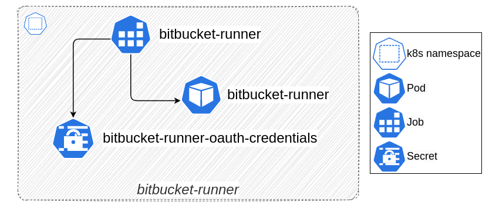

# Bitbucket Pipelines Runner for Kubernetes

Module deploys [docker-based Bitbucket Pipelines Runner](https://support.atlassian.com/bitbucket-cloud/docs/runners/) into a Kubernetes cluster.

You need to [add a new runner](https://support.atlassian.com/bitbucket-cloud/docs/adding-a-new-runner-in-bitbucket/) in your Bitbucket repository or workspace. On the second step of adding a new runner, it is necessary to get all credentials for runner configuration (`oauth_client_id`, `oauth_client_secret`, `account_uuid`, `repository_uuid` (in case of adding a **repository** runner), `runner_uuid`) from the pre-configured Docker command.

> **Note:** it is important to add the values of these credentials without curly braces.

To use your runner in Bitbucket Pipelines you need to [configure the runner](https://support.atlassian.com/bitbucket-cloud/docs/configure-your-runner-in-bitbucket-pipelines-yml/) in `bitbucket-pipelines.yml`.

## Links

* [Kubernetes Terraform provider documentation](https://registry.terraform.io/providers/hashicorp/kubernetes/latest/docs#authentication)
* [Bitbucket Pipelines Runner Documentation](https://support.atlassian.com/bitbucket-cloud/docs/runners/)
* [Adding a new runner in Bitbucket Pipelines](https://support.atlassian.com/bitbucket-cloud/docs/adding-a-new-runner-in-bitbucket/)
* [Bitbucket Pipelines Runner configuration](https://support.atlassian.com/bitbucket-cloud/docs/configure-your-runner-in-bitbucket-pipelines-yml/)
* [Bitbucket Pipelines Runner versions changelog](https://product-downloads.atlassian.com/software/bitbucket/pipelines/changelog.html)
